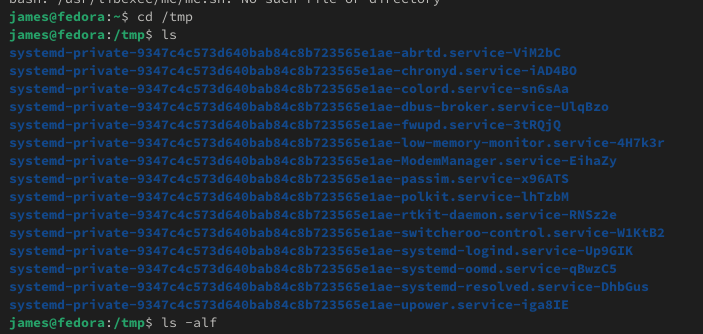
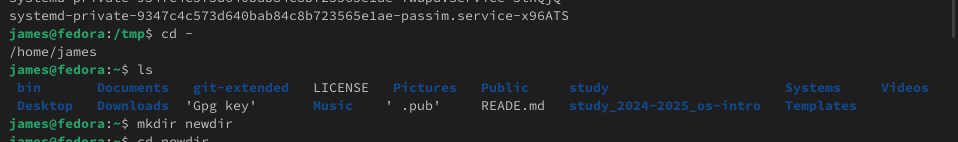
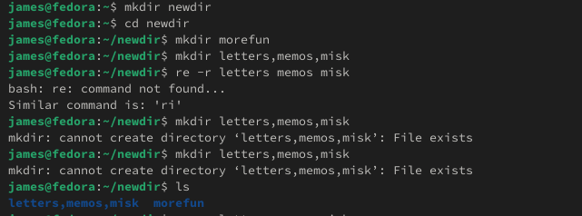
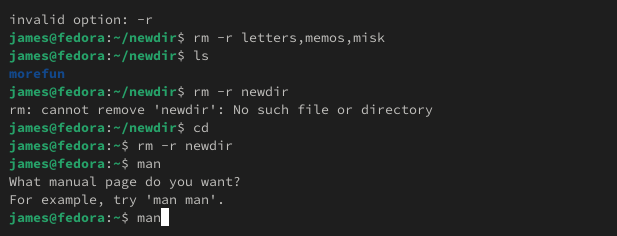
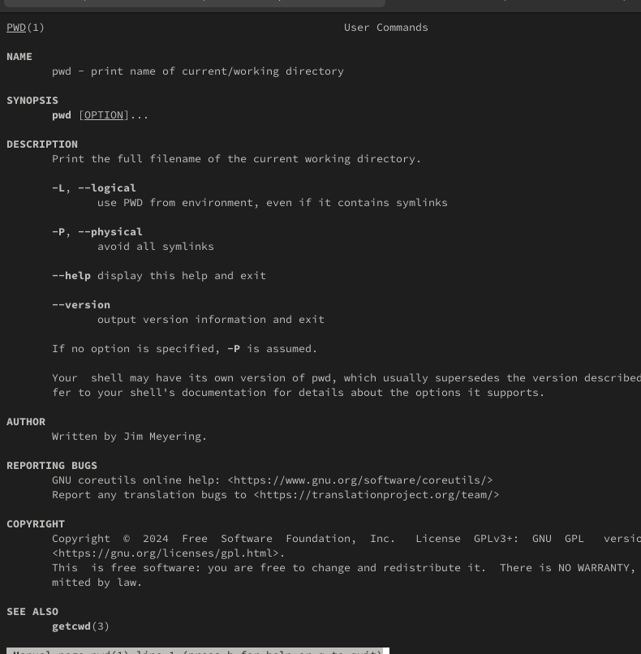
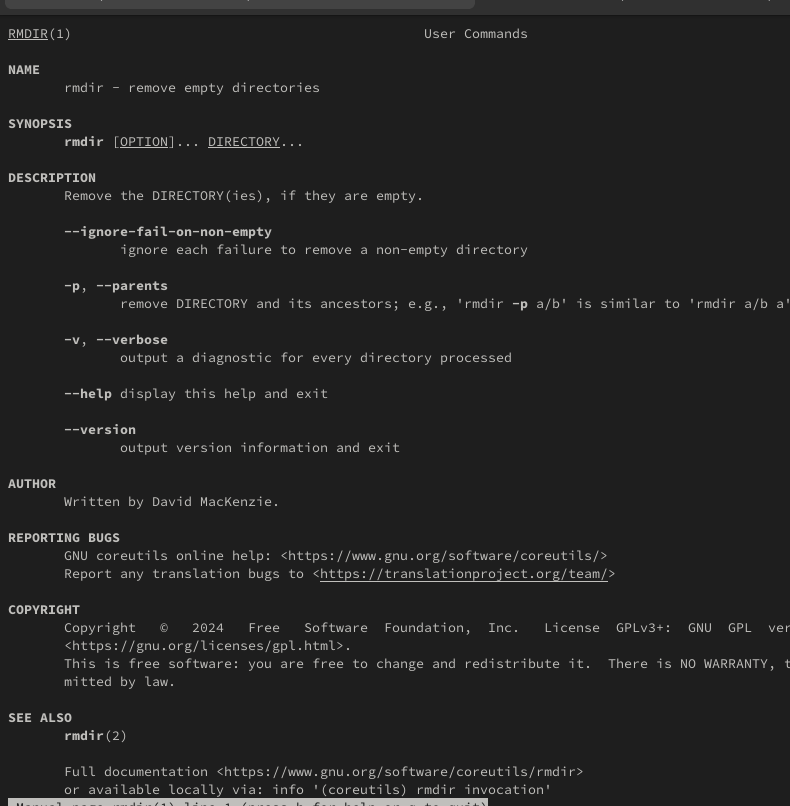
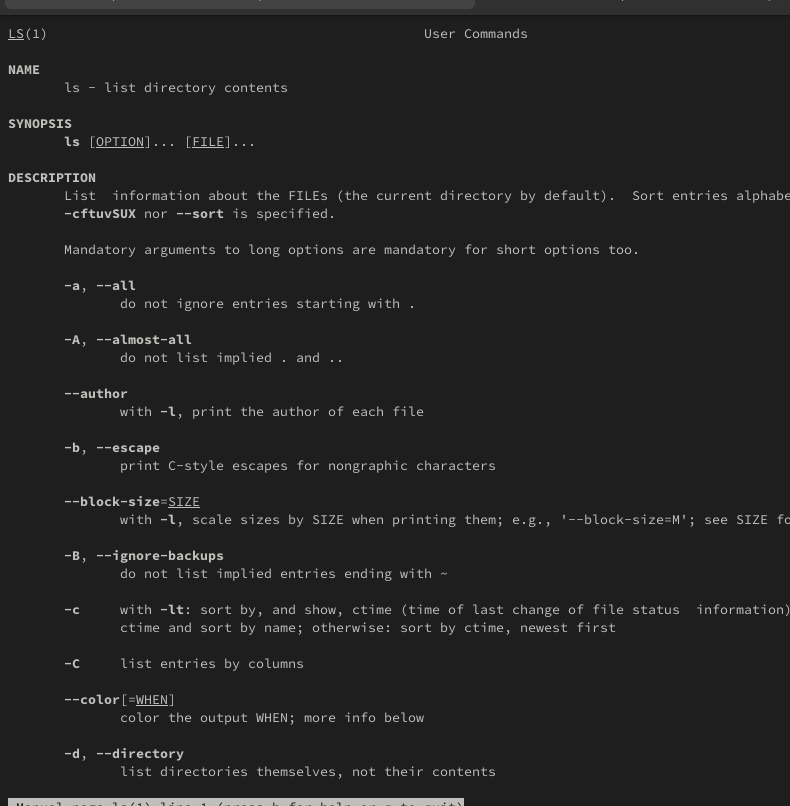

## Front matter
lang: ru-RU
title: Лабораторная работа № 6
subtitle: Архитектура компьютера, раздел Операционные системы
author:
  - Кусоро М.Дж.
institute:
  - Российский университет дружбы народов, Москва, Россия

## i18n babel
babel-lang: russian
babel-otherlangs: english

## Formatting pdf
toc: false
toc-title: Содержание
slide_level: 2
aspectratio: 169
section-titles: true
theme: metropolis
header-includes:
  - \metroset{progressbar=frametitle,sectionpage=progressbar,numbering=fraction}
---

# Информация

## Доклад

:::::::::::::: {.columns align=center}
::: {.column width="70%"}

  * Кусоро Майова Джеймс
  * НКАбд-01-24, студ. билет №1032244581
  * Российский университет дружбы народов
  * <https://github.com/James-4321/study_2024-2025_os-intro>

:::
::: {.column width="30%"}

:::
::::::::::::::

---

# Цель работы

Приобретение практических навыков взаимодействия пользователя с системой посредством командной строки.

---

## Задание

1. Определите полное имя вашего домашнего каталога. Далее относительно этого каталога будут выполняться последующие упражнения.
2. Выполните следующие действия:
   2.1. Перейдите в каталог `/tmp`.
   2.2. Выведите на экран содержимое каталога `/tmp`. Для этого используйте команду `ls` с различными опциями. Поясните разницу в выводимой на экран информации.
   2.3. Определите, есть ли в каталоге `/var/spool` подкаталог с именем `cron`?
   2.4. Перейдите в ваш домашний каталог и выведите на экран его содержимое. Определите, кто является владельцем файлов и подкаталогов?
3. Выполните следующие действия:
   3.1. В домашнем каталоге создайте новый каталог с именем `newdir`.
   3.2. В каталоге `~/newdir` создайте новый каталог с именем `morefun`.
   3.3. В домашнем каталоге создайте одной командой три новых каталога с именами `letters`, `memos`, `misk`. Затем удалите эти каталоги одной командой.
   3.4. Попробуйте удалить ранее созданный каталог `~/newdir` командой `rm`. Проверьте, был ли каталог удалён.
   3.5. Удалите каталог `~/newdir/morefun` из домашнего каталога. Проверьте, был ли каталог удалён.
4. С помощью команды `man` определите, какую опцию команды `ls` нужно использовать для просмотра содержимого не только указанного каталога, но и подкаталогов, входящих в него.
5. С помощью команды `man` определите набор опций команды `ls`, позволяющий отсортировать по времени последнего изменения выводимый список содержимого каталога с развёрнутым описанием файлов.
6. Используйте команду `man` для просмотра описания следующих команд: `cd`, `pwd`, `mkdir`, `rmdir`, `rm`. Поясните основные опции этих команд.
7. Используя информацию, полученную при помощи команды `history`, выполните модификацию и исполнение нескольких команд из буфера команд.

---

## Теоретическое введение

В операционной системе типа Linux взаимодействие пользователя с системой обычно осуществляется с помощью командной строки посредством построчного ввода команд. При этом обычно используются командные интерпретаторы языка shell: `/bin/sh`, `/bin/csh`, `/bin/ksh`. Формат команды: `<имя_команды><разделитель><аргументы>`.

---

## Выполнение лабораторной работы

1. Определим полное имя домашнего каталога. Перейдем в каталог `/tmp`. Выведем на экран содержимое каталога `/tmp`. Для этого используем команду `ls` с различными опциями.

{#fig:001 width=70%}

---

{#fig:002 width=70%}

---

{#fig:003 width=70%}

---

2. Перейдите в ваш домашний каталог и выведите на экран его содержимое. Владелец файлов — я.

{#fig:005 width=70%}

---

3. В домашнем каталоге создадим новый каталог с именем `newdir`. В каталоге `~/newdir` создадим новый каталог с именем `morefun`.

{#fig:006 width=70%}

---

4. В домашнем каталоге создадим одной командой три новых каталога с именами `letters`, `memos`, `misk`. Затем удалим эти каталоги.

{#fig:007 width=70%}

---

5. Попробуем удалить ранее созданный каталог `~/newdir` командой `rm`. Проверим, был ли каталог удалён. Удалим каталог `~/newdir/morefun` из домашнего каталога.

{#fig:008 width=70%}

---

6. С помощью команды `man` определим, какую опцию команды `ls` нужно использовать для просмотра содержимого не только указанного каталога, но и подкаталогов, входящих в него.

{#fig:009 width=70%}

---

{#fig:010 width=70%}

---

7. Используем команду `man` для просмотра описания следующих команд: `cd`, `pwd`, `mkdir`, `rmdir`, `rm`.

{#fig:011 width=70%}

---

{#fig:012 width=70%}

---

{#fig:013 width=70%}

---

{#fig:014 width=70%}

---

{#fig:015 width=70%}

---

8. Используя информацию, полученную при помощи команды `history`, выполним модификацию и исполнение нескольких команд из буфера команд.

{#fig:016 width=70%}

--- 
## Контрольные вопросы

1. Что такое командная строка? Командная строка (или «консоль») – это текстовый интерфейс между человеком и компьютером, в котором инструкции компьютеру даются путём ввода с клавиатуры текстовых строк (команд). Интерфейс командной строки противопоставляется управлению программами на основе меню, а также различным реализациям графического интерфейса. Команды, введённые пользователем, интерпретируются и выполняются специальной программой — командной оболочкой (или «shell» по-английски).
2. При помощи какой команды можно определить абсолютный путь текущего каталога? Приведите пример. Для определения абсолютного пути к текущему каталогу используется команда pwd (print working directory). Пример (абсолютное имя текущего каталога пользователя dharma): (pwd результат: /afs/dk.sci.pfu.edu.ru/home/d/h/dharma)
3. При помощи какой команды и каких опций можно определить только тип файлов и их имена в текущем каталоге? Приведите примеры. При помощи команды ls -F. (ls -F install-tl-unx/ newdir/ work/ Видео/ Документы/ Загрузки/ Изображения/ Музыка/ Общедоступные/ 'Рабочий стол'/ Шаблоны/)

##

4. Каким образом отобразить информацию о скрытых файлах? Приведите примеры. С помощью команды ls -a. (ls -a . .bash_logout .cache .gnupg .local .pki .var .vboxclient-draganddrop.pid .wget-hsts Документы Музыка Шаблоны .. .bash_profile .config install-tl-unx .mozilla .ssh .vboxclient-clipboard.pid .vboxclient-seamless.pid work Загрузки Общедоступные .bash_history .bashrc .gitconfig .lesshst newdir .texlive2022 .vboxclient-display-svga-x11.pid .vscode Видео Изображения 'Рабочий стол')
5. При помощи каких команд можно удалить файл и каталог? Можно ли это сделать одной и той же командой? Приведите примеры. Команда rm используется для удаления файлов и/или каталогов. Чтобы удалить каталог, содержащий файлы, нужно использовать опцию r. Без указания этой опции команда не будет выполняться (rm -r abc). Если каталог пуст, то можно воспользоваться командой rmdir. Если удаляемый каталог содержит файлы, то команда не будет выполнена — нужно использовать rm - r имя_каталога.
6. Каким образом можно вывести информацию о последних выполненных пользователем командах? работы? С помощью команды history.
7. Как воспользоваться историей команд для их модифицированного выполнения? Приведите примеры. Можно модифицировать команду из выведенного на экран списка при помощи следующей конструкции: !<номер_команды>:s/<что_меняем>/<на_что_меняем> (!3:s/a/F ls -F)

##

8. Приведите примеры запуска нескольких команд в одной строке. Если требуется выполнить последовательно несколько команд, записанный в одной строке, то для этого используется символ точка с запятой. (cd; ls)
9. Дайте определение и приведите примера символов экранирования. Если в заданном контексте встречаются специальные символы (типа «.», «/», «*» и т.д.), надо перед ними поставить символ экранирования \ (обратный слэш).
10. Охарактеризуйте вывод информации на экран после выполнения команды ls с опцией l. Чтобы вывести на экран подробную информацию о файлах и каталогах, необходимо использовать опцию l. При этом о каждом файле и каталоге будет выведена следующая информация: – тип файла, – право доступа, – число ссылок, – владелец, – размер, – дата последней ревизии, – имя файла или каталога.

##

11. Что такое относительный путь к файлу? Приведите примеры использования относительного и абсолютного пути при выполнении какой-либо команды. Относительный путь — это ссылка, указывающая на другие страницы вашего сайта относительно веб-страницы, на которой эта ссылка уже находится. Пример относительно пути: ./docs/files/file.txt Пример абсолютного пути: cd /home/dmbelicheva/work/study
12. Как получить информацию об интересующей вас команде? С помощью команды hepl.
13. Какая клавиша или комбинация клавиш служит для автоматического дополнения вводимых команд? Клавиша Tab.

## Выводы

Мы приобрели практические навыки взаимодействия пользователя с системой посредством командной строки.

# Список литературы{.unnumbered}

Настройка электронной среды. (электронный ресурс) URL: https://yamadharma.github.io/ru/teaching/os-intro/lab/lab-work-environment-setup/

::: {#refs}
:::

