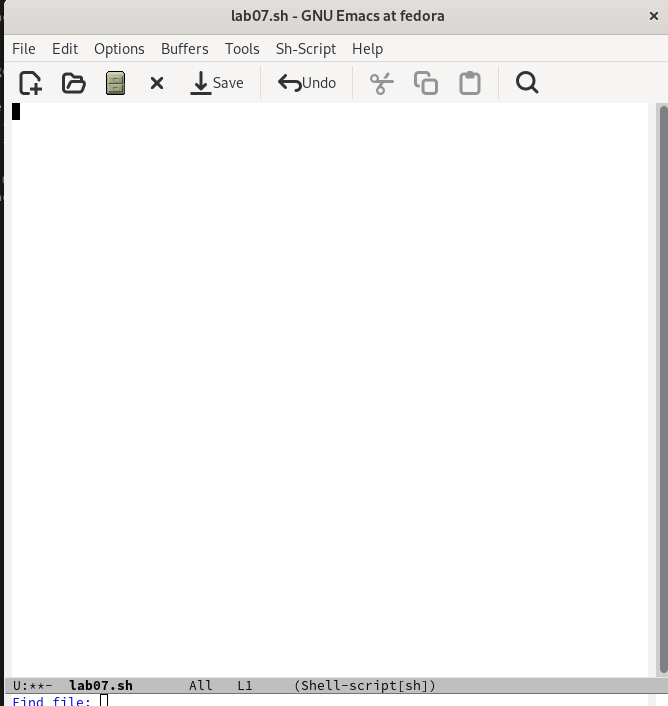
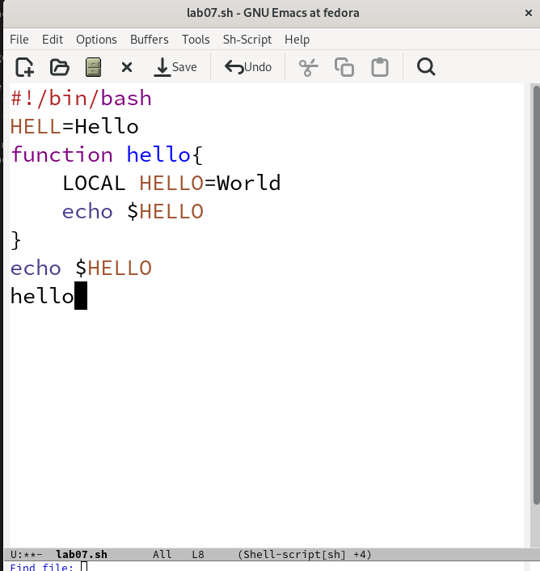
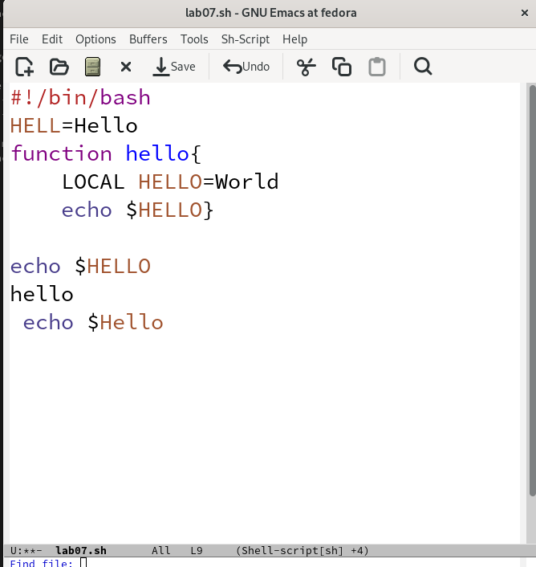
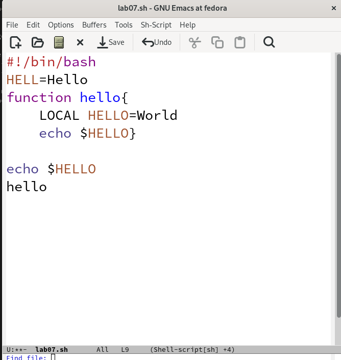
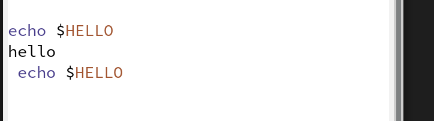
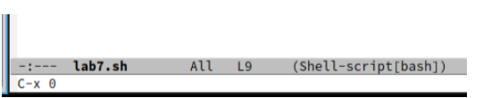
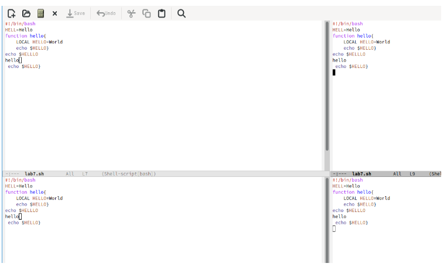
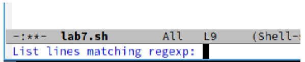
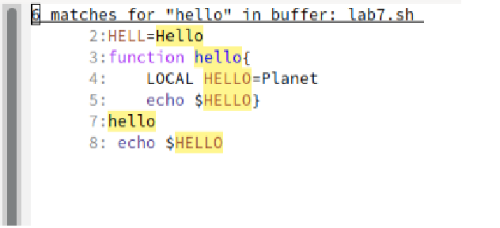

---
## Front matter
title: "Отчет по лабораторной работе № 11"
subtitle: Архитектура компьютера, раздел Операционные системы
author: "Кусоро Майова Джеймс"

## Generic otions
lang: ru-RU
toc-title: "Содержание"

## Bibliography
bibliography: bib/cite.bib
csl: pandoc/csl/gost-r-7-0-5-2008-numeric.csl

## Pdf output format
toc: true # Table of contents
toc-depth: 2
lof: true # List of figures
lot: true # List of tables
fontsize: 12pt
linestretch: 1.5
papersize: a4
documentclass: scrreprt
## I18n polyglossia
polyglossia-lang:
  name: russian
  options:
	- spelling=modern
	- babelshorthands=true
polyglossia-otherlangs:
  name: english
## I18n babel
babel-lang: russian
babel-otherlangs: english
## Fonts
mainfont: IBM Plex Serif
romanfont: IBM Plex Serif
sansfont: IBM Plex Sans
monofont: IBM Plex Mono
mathfont: STIX Two Math
mainfontoptions: Ligatures=Common,Ligatures=TeX,Scale=0.94
romanfontoptions: Ligatures=Common,Ligatures=TeX,Scale=0.94
sansfontoptions: Ligatures=Common,Ligatures=TeX,Scale=MatchLowercase,Scale=0.94
monofontoptions: Scale=MatchLowercase,Scale=0.94,FakeStretch=0.9
mathfontoptions:
## Biblatex
biblatex: true
biblio-style: "gost-numeric"
biblatexoptions:
  - parentracker=true
  - backend=biber
  - hyperref=auto
  - language=auto
  - autolang=other*
  - citestyle=gost-numeric
## Pandoc-crossref LaTeX customization
figureTitle: "Рис."
tableTitle: "Таблица"
listingTitle: "Листинг"
lofTitle: "Список иллюстраций"
lotTitle: "Список таблиц"
lolTitle: "Листинги"
## Misc options
indent: true
header-includes:
  - \usepackage{indentfirst}
  - \usepackage{float} # keep figures where there are in the text
  - \floatplacement{figure}{H} # keep figures where there are in the text
---

# Цель 

Познакомиться с операционной системой Linux. Получить практические навыки рабо-
ты с редактором Emacs.

# Задание

1. Открыть emacs.
2. Создать файл lab07.sh с помощью комбинации Ctrl-x Ctrl-f (C-x C-f).
3. Наберите текст
4. Сохранить файл с помощью комбинации Ctrl-x Ctrl-s (C-x C-s).
5. Проделать с текстом стандартные процедуры редактирования, каждое действие долж-
но осуществляться комбинацией клавиш.
5.1. Вырезать одной командой целую строку (С-k).
5.2. Вставить эту строку в конец файла (C-y).
5.3. Выделить область текста (C-space).
5.4. Скопировать область в буфер обмена (M-w).
5.5. Вставить область в конец файла.
5.6. Вновь выделить эту область и на этот раз вырезать её (C-w).
5.7. Отмените последнее действие (C-/).
6. Научитесь использовать команды по перемещению курсора.
6.1. Переместите курсор в начало строки (C-a).
6.2. Переместите курсор в конец строки (C-e).
6.3. Переместите курсор в начало буфера (M-<).
6.4. Переместите курсор в конец буфера (M->).
7. Управление буферами.
7.1. Вывести список активных буферов на экран (C-x C-b).
7.2. Переместитесь во вновь открытое окно (C-x) o со списком открытых буферов
и переключитесь на другой буфер.
7.3. Закройте это окно (C-x 0).
7.4. Теперь вновь переключайтесь между буферами, но уже без вывода их списка на
экран (C-x b).
8. Управление окнами.
8.1. Поделите фрейм на 4 части: разделите фрейм на два окна по вертикали (C-x 3),
а затем каждое из этих окон на две части по горизонтали (C-x 2)
8.2. В каждом из четырёх созданных окон откройте новый буфер (файл) и введите
несколько строк текста.
9. Режим поиска
9.1. Переключитесь в режим поиска (C-s) и найдите несколько слов, присутствующих
в тексте.
9.2. Переключайтесь между результатами поиска, нажимая C-s.
9.3. Выйдите из режима поиска, нажав C-g.
9.4. Перейдите в режим поиска и замены (M-%), введите текст, который следует найти
и заменить, нажмите Enter , затем введите текст для замены. После того как будут
подсвечены результаты поиска, нажмите ! для подтверждения замены.
9.5. Испробуйте другой режим поиска, нажав M-s o. Объясните, чем он отличается от
обычного режима?

# Теоретическое введение

Основные термины Emacs
Определение 1. Буфер — объект, представляющий какой-либо текст.
Буфер может содержать что угодно, например, результаты компиляции программы
или встроенные подсказки. Практически всё взаимодействие с пользователем, в том
числе интерактивное, происходит посредством буферов.
Определение 2. Фрейм соответствует окну в обычном понимании этого слова. Каждый
фрейм содержит область вывода и одно или несколько окон Emacs.
Определение 3. Окно — прямоугольная область фрейма, отображающая один из буфе-
ров.
Каждое окно имеет свою строку состояния, в которой выводится следующая информа-
ция: название буфера, его основной режим, изменялся ли текст буфера и как далеко вниз
по буферу расположен курсор. Каждый буфер находится только в одном из возможных
основных режимов. Существующие основные режимы включают режим Fundamental
(наименее специализированный), режим Text, режим Lisp, режим С, режим Texinfo
и другие. Под второстепенными режимами понимается список режимов, которые вклю-
чены в данный момент в буфере выбранного окна.
Определение 4. Область вывода — одна или несколько строк внизу фрейма, в которой
Emacs выводит различные сообщения, а также запрашивает подтверждения и дополни-
тельную информацию от пользователя.
Определение 5. Минибуфер используется для ввода дополнительной информации и все-
гда отображается в области вывода.
Определение 6. Точка вставки — место вставки (удаления) данных в буфере.

# Выполнение лабораторной работы
Для данной работы, мне надо была установить Emacs:

{#fig:001 width=70%}

Выполнив Emacs в командной строке, я открыла текстовый редактор:

{#fig:002 width=70%}

С помощью комбинации Ctrl-x Ctrl-f, создала файл lab07.sh:

{#fig:003 width=70%}

Я написала некоторый текст в этом же файле (lab07.sh). После этого сохранила файл с помощью комбинации Ctrl-x Ctrl-s:

{#fig:004 width=70%}

Одной командой вырезала целую строку (С-k):

{#fig:005 width=70%}

С помощью C-y вставила эту строку в конец файла:

{#fig:006 width=70%}

Выделила область текста (C-space):

{#fig:007 width=70%}

Скопировала область в буфер обмена (M-w) и вставила ее в конец файла:

{#fig:008 width=70%}

Выделила эту же область и на этот раз вырезала её (C-w):

{#fig:009 width=70%}

С помощью C-/ отменила последнее действие:

{#fig:0010 width=70%}

С помощью C-a переместила курсор в начало строки:

{#fig:0011 width=70%}

С помощью C-e переместила курсор в конец строки:

{#fig:0012 width=70%}

Переместила курсор в начало и конец буфера с помощью M-< и M-> соответственно:

{#fig:0013 width=70%}

Выводила список активных буферов на экран с помощью C-x C-b:

{#fig:0014 width=70%}

С помощью C-x o переместилась во вновь открытое окно со списком открытых буферов и переключилась на другой буфер:

{#fig:0015 width=70%}

С помощью C-x 0 закрыла окно со списком открытых буферов:

{#fig:0016 width=70%}

Без вывода списка буферов, я переключилась между буферами:

{#fig:0017 width=70%}

{#fig:0018 width=70%}

Поделила фрейм на 4 части. Сначала я разделила фрейм на два окна по вертикали (C-x 3), а затем каждое из этих окон на две части по горизонтали (C-x 2):

{#fig:0019 width=70%}

В каждом из четырёх созданных окон открыла новый буфер: 

{#fig:0020 width=70%}

Переключилась в режим поиска (C-s) и искала Indent:

{#fig:0021 width=70%}

Переключалась между результатами поиска, нажимая C-s и вышла из режима поиска, нажав C-g:

{#fig:0022 width=70%}

Перешла в режим поиска и замены (M-%), искала слово World, нажмала Enter, и заменила на Planet:

{#fig:0023 width=70%}

Нажав M-s o, я использовала другой режим поиска. Он отличается от предыдущего тем, что выводит результаты поиска в новом окне:

{#fig:0024 width=70%}

{#fig:0025 width=70%}

# Выводы

При выполнение данной работы я получила практические навыки работы с Emacs.

# Ответы на котрольные вопросы

1. Emacs — один из наиболее мощных и широко распространённых редакторов, используемых в мире UNIX. Написан на языке высокого уровня Lisp.

2. Большое разнообразие сложных комбинаций клавиш, которые необходимы для редактирования файла и в принципе для работа с Emacs.

3. Буфер - это объект в виде текста. Окно - это область, в которой отображен буфер.

4. Да, можно.

5. Emacs использует буферы с именами, начинающимися с пробела, для внутренних целей. Отчасти он обращается с буферами с такими именами особенным образом — например, по умолчанию в них не записывается информация для отмены изменений.

6. Ctrl + c, а потом | и Ctrl + c Ctrl + |

7. С помощью команды Ctrl + x 3 (по вертикали) и Ctrl + x 2 (по горизонтали).

8. Настройки emacs хранятся в файле . emacs, который хранится в домашней дирректории пользователя. Кроме этого файла есть ещё папка . emacs.

9. Выполняет функцию стереть, думаю можно переназначить.

10. Для меня удобнее был редактор Emacs, так как у него есть командая оболочка. А vi открывается в терминале, и выглядит своеобразно.

# Выводы

Мы Познакомились с операционной системой Linux. Получили практические навыки работы с редактором Emacs.
# Список литературы{.unnumbered}

::: {#refs}
:::
